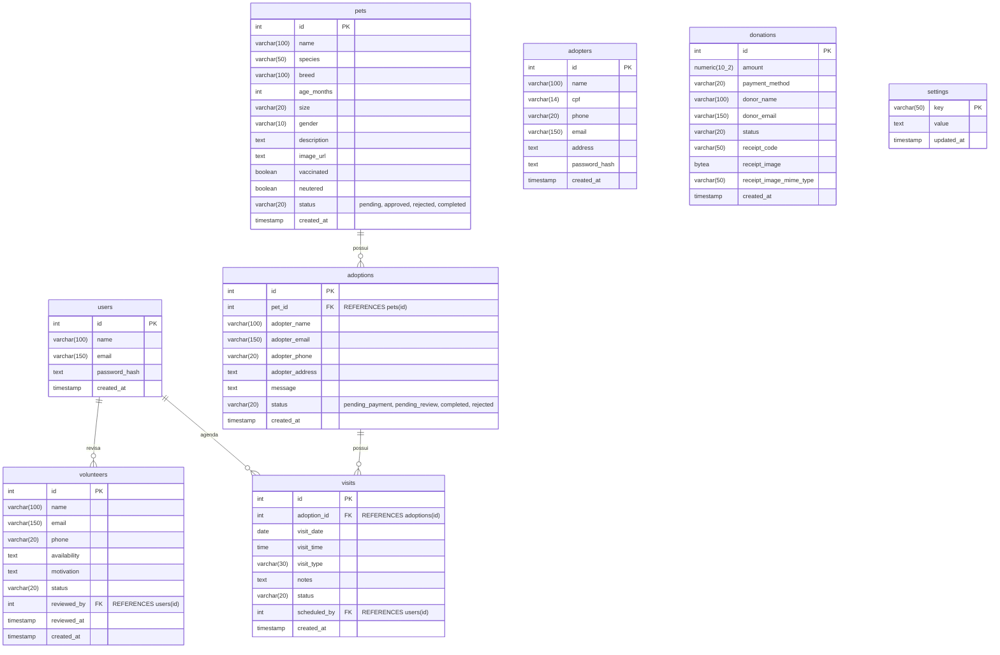

# Modelo de Entidades e Relacionamentos (ER)

Abaixo está o diagrama de Entidades e Relacionamentos do banco de dados do projeto **Adota Pet**, baseado no arquivo de configuração do banco (`src/backend/config/seed.sql`).

## Relacionamentos Principais

1. **`pets` e `adoptions`** (1 para N):
   - Um pet pode ter várias solicitações de adoção (ao longo do tempo ou simultâneas, caso em aberto). 
   - A tabela `adoptions` guarda a chave estrangeira `pet_id`.
   - *Atenção:* Os dados do adotante estão diretamente na tabela `adoptions` e não vinculados à tabela `adopters` por uma chave estrangeira no modelo atual.

2. **`adoptions` e `visits`** (1 para N):
   - Uma solicitação de adoção pode ter várias visitas agendadas.
   - A tabela `visits` guarda a chave estrangeira `adoption_id`.

3. **`users` e `visits`** (1 para N):
   - Um usuário (admin/membro da ONG) pode agendar e ser responsável por várias visitas.
   - A tabela `visits` guarda a chave estrangeira `scheduled_by`.

4. **`users` e `volunteers`** (1 para N):
   - Um usuário (admin/membro da ONG) revisa os cadastros de voluntários.
   - A tabela `volunteers` guarda a chave estrangeira `reviewed_by`.

## Tabelas Independentes
- **`adopters`**: Guarda dados de usuários cadastrados para adoção.
- **`donations`**: Registro de doações, independentes de outras tabelas.
- **`settings`**: Tabela de chave-valor simples para guardar configurações do sistema (ex: chave PIX, e-mail do projeto).

## Tabelas operacionais
- **`adoption_status_history`**, **`adoption_checklists`** e **`adoption_deliveries`**: acompanham a evolução, a conferência e a entrega final de cada adoção.
- **`pet_health_records`** e **`pet_vaccinations`**: armazenam atendimentos veterinários, custos e vencimentos de vacinas.
- **`inventory_items`**: controla medicamentos, ração e materiais com estoque mínimo.
- **`foster_homes`** e **`foster_assignments`**: registram lares temporários e os pets acolhidos.
- **`volunteer_shifts`**: agenda turnos de voluntários aprovados.
- **`expenses`**: registra despesas da ONG para composição do relatório financeiro mensal.
- **`audit_logs`**: registra ações administrativas relevantes, usuário responsável e metadados da operação.
